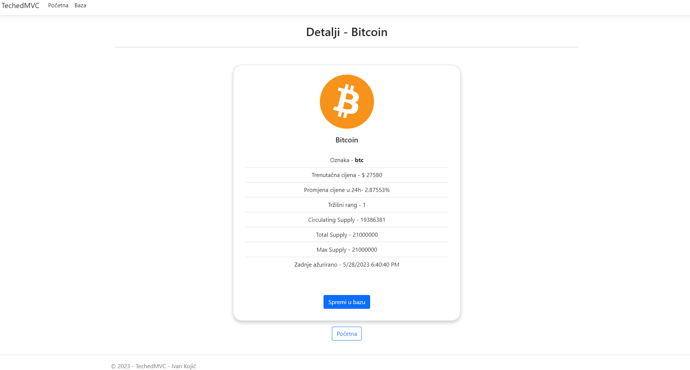
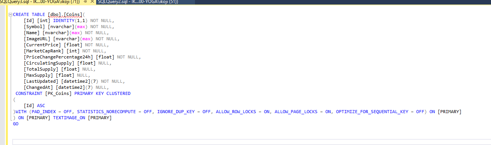

# TechedMVC

## Kod
 

Kako se zna dogoditi da se dobije greška "429 TooManyRequest" pozivajući API često, neke metode unutar Home i Coin kontrolera sam su napravljene na dva načina. 
 

Obje metode, i Details i Details2 metode prikazuju odgovarajuće podatke na pripradajućim View stranicama. Jedna prima ID te nanovo popuni listu pozivajuci API.
Druga prima cijeli objekt u JSON formatu te ga takvog pretvara u odgovarajući objekt.
 
 
 

Isto kao u primjeru iznad, jedna metoda prima Id, poziva API kako bi popunila listu te dohvati odgovarajući objekt iz liste. Druga prima cijeli objekt u JSON formatu.
 
 
 

## Slike projekta
 

*/Home page*
 
 

*/Home/Details/ page*
 
 

*/Coin page*
 
 

*/Coin/Details/ page*
 
 

*/Coin/Edit/ page*
 
 

 
 

*/Coin/Delete/ page*

 
 
 

## Baza podataka
 

Za izradu baze podataka korišten je Entity Framework sa Code-First pristupom. "Coin" tablica je izgenerirana po CoinEntity model klasi.

 

*Pregled spremljenih podataka u bazi podataka*
 
 

*Generirana skripta za izradu tablice*